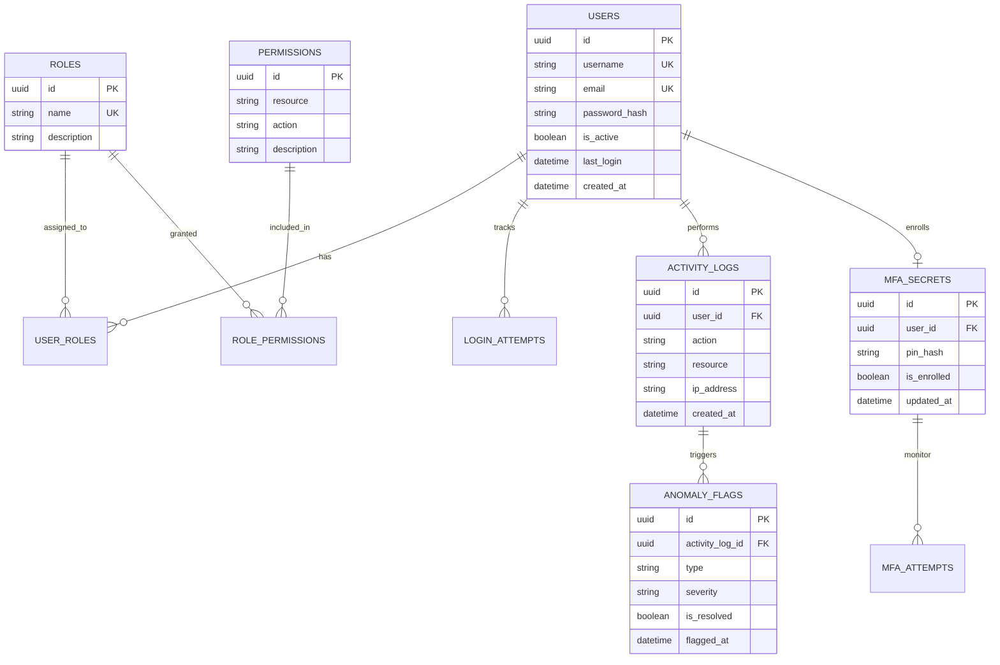

# Master Database System: IAM Security Architecture

This document presents the unified, production-grade database architecture for the IAM Security System, consolidating all developments from Sprints 1-4 and Phase 5.

---

## 1. Master Entity Relationship Diagram (ERD)

The following diagram visualizes the relationships between the core identity layers, the defensive monitoring perimeter, and the unified MFA authentication logic.



---

## 2. Full Unified SQL Schema (SQL Server 2022)

This script provides the complete, one-step deployment logic for the entire IAM Security namespace.

```sql
-- =============================================
-- IAM SECURITY SYSTEM - MASTER UNIFIED SCHEMA
-- =============================================

USE master;
GO
IF EXISTS (SELECT * FROM sys.databases WHERE name = 'iam_security')
    DROP DATABASE iam_security;
GO
CREATE DATABASE iam_security;
GO
USE iam_security;
GO

-- 1. IDENTITY & ACCESS CONTROL
CREATE TABLE users (
    id            UNIQUEIDENTIFIER PRIMARY KEY DEFAULT NEWID(),
    username      NVARCHAR(50)  NOT NULL UNIQUE,
    email         NVARCHAR(100) NOT NULL UNIQUE,
    password_hash NVARCHAR(255) NOT NULL,
    is_active     BIT           NOT NULL DEFAULT 1,
    created_at    DATETIME2     NOT NULL DEFAULT GETDATE(),
    last_login    DATETIME2     NULL
);

CREATE TABLE roles (
    id          UNIQUEIDENTIFIER PRIMARY KEY DEFAULT NEWID(),
    name        NVARCHAR(50)  NOT NULL UNIQUE,
    description NVARCHAR(255) NULL
);

CREATE TABLE permissions (
    id          UNIQUEIDENTIFIER PRIMARY KEY DEFAULT NEWID(),
    resource    NVARCHAR(50)  NOT NULL,
    action      NVARCHAR(50)  NOT NULL,
    description NVARCHAR(255) NULL,
    CONSTRAINT uq_perm UNIQUE (resource, action)
);

CREATE TABLE user_roles (
    id      UNIQUEIDENTIFIER PRIMARY KEY DEFAULT NEWID(),
    user_id UNIQUEIDENTIFIER NOT NULL REFERENCES users(id) ON DELETE CASCADE,
    role_id UNIQUEIDENTIFIER NOT NULL REFERENCES roles(id) ON DELETE CASCADE,
    CONSTRAINT uq_user_role UNIQUE (user_id, role_id)
);

CREATE TABLE role_permissions (
    id            UNIQUEIDENTIFIER PRIMARY KEY DEFAULT NEWID(),
    role_id       UNIQUEIDENTIFIER NOT NULL REFERENCES roles(id) ON DELETE CASCADE,
    permission_id UNIQUEIDENTIFIER NOT NULL REFERENCES permissions(id) ON DELETE CASCADE,
    CONSTRAINT uq_role_perm UNIQUE (role_id, permission_id)
);

-- 2. MULTI-FACTOR AUTHENTICATION LAYER
CREATE TABLE mfa_secrets (
    id          UNIQUEIDENTIFIER PRIMARY KEY DEFAULT NEWID(),
    user_id     UNIQUEIDENTIFIER NOT NULL REFERENCES users(id) ON DELETE CASCADE,
    pin_hash    NVARCHAR(255) NOT NULL,
    is_enrolled BIT NOT NULL DEFAULT 1,
    updated_at  DATETIME2 NOT NULL DEFAULT GETDATE(),
    CONSTRAINT uq_mfa_user UNIQUE (user_id)
);

-- 3. DEFENSIVE TELEMETRY & MONITORING
CREATE TABLE login_attempts (
    id             UNIQUEIDENTIFIER PRIMARY KEY DEFAULT NEWID(),
    user_id        UNIQUEIDENTIFIER NULL REFERENCES users(id) ON DELETE SET NULL,
    ip_address     NVARCHAR(45) NOT NULL,
    success        BIT NOT NULL DEFAULT 0,
    failure_reason NVARCHAR(255) NULL,
    attempted_at   DATETIME2 NOT NULL DEFAULT GETDATE()
);

CREATE TABLE activity_logs (
    id         UNIQUEIDENTIFIER PRIMARY KEY DEFAULT NEWID(),
    user_id    UNIQUEIDENTIFIER NULL REFERENCES users(id) ON DELETE SET NULL,
    action     NVARCHAR(100) NOT NULL,
    resource   NVARCHAR(255) NOT NULL,
    ip_address NVARCHAR(45) NULL,
    created_at DATETIME2 NOT NULL DEFAULT GETDATE()
);

CREATE TABLE anomaly_flags (
    id              UNIQUEIDENTIFIER PRIMARY KEY DEFAULT NEWID(),
    activity_log_id UNIQUEIDENTIFIER NOT NULL REFERENCES activity_logs(id) ON DELETE CASCADE,
    type            NVARCHAR(100) NOT NULL,
    severity        NVARCHAR(20) NOT NULL CHECK (severity IN ('low', 'medium', 'high', 'critical')),
    is_resolved     BIT NOT NULL DEFAULT 0,
    flagged_at      DATETIME2 NOT NULL DEFAULT GETDATE()
);

-- 4. PERFORMANCE OPTIMIZATION (INDEXES)
CREATE INDEX ix_audit_user_id ON activity_logs (user_id);
CREATE INDEX ix_audit_time    ON activity_logs (created_at);
CREATE INDEX ix_anomaly_log   ON anomaly_flags (activity_log_id);
CREATE INDEX ix_login_ip      ON login_attempts (ip_address);
GO

-- 5. SEED DATA
INSERT INTO roles (name, description) VALUES ('admin', 'System Owner'), ('viewer', 'Read Only');
INSERT INTO permissions (resource, action) VALUES ('system', 'manage'), ('audit', 'view');
GO

PRINT 'Master IAM Security Database Deployed Successfully.';
```

---

## 3. Data Integrity & Normalization

> [!TIP]
> **Orphan Prevention**: All telemetry tables (`activity_logs`, `login_attempts`) use `ON DELETE SET NULL` for the `user_id` field. This ensures that even if a user is purged from the system, their forensic audit trail remains intact for historical analysis.
> **Cardinality Verification**: The M:N relationships between Users and Roles are properly resolved via the `user_roles` junction table, supporting enterprise-grade multi-tenancy and hierarchical access.
